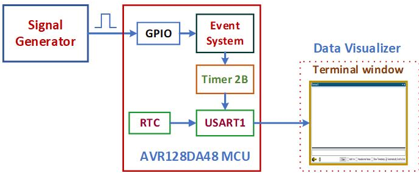

# Introduction  
The Timer/Counter type B (TCB) module of the AVR-DA family of devices offers a variety of features and operation modes, from periodic interrupts to 8-bit PWM mode. The various operation modes of the TCB can be used in correlation with the event system. The capabilities of the 16-bit Timer/Counter type B includes single pulse generation and input capture on event with frequency and pulse width measurement of the digital signals. 
This example explains, how the Timer/Counter type B module of AVR128DA48 microcontroller is used to measure the frequency and duty cycle of the pulse waveform.

**Note:** ***This example could be generated with all the pin variants of AVR-DA family of microcontrollers.***

## Useful Links

- [AVR128DA48 Product Page](https://www.microchip.com/wwwproducts/en/AVR128DA28 "AVR128DA48 Product Page")
- [AVR128DA48 Code Examples on GitHub](https://github.com/microchip-pic-avr-examples?q=avr128da48 "AVR128DA48 Code Examples on GitHub")
- [AVR128DA48 Project Examples in START](https://start.atmel.com/#examples/AVR128DA48CuriosityNano "AVR128DA48 Project Examples in START")
- [Frequency and Duty cycle measurement - Studio Example]( https://github.com/microchip-pic-avr-examples/avr128da48-tcb-frequency-dutycycle-measurement-studio.git "Frequency and Duty cycle measurement")

# Demo Description

***Fig 1: Block diagram view of the system used for Frequency and Duty cycle measurement.***

  

In this example,
* A signal generator is used as a source to generate input pulse signal, with a known frequency and duty cycle.
* The frequency of input pulse signal should be within the range of 500Hz to 200KHz.
* The frequency and duty cycle of the input pulse signal to be measured is fed to the pin PA6 of the microcontroller.
* Event system channel-0 is used to interact with pin PA6 and Timer/Counter type B, without CPU interaction. Here, pin PA6 is the event generator and Timer B module is the event user. 
* The timer is configured to work in the “Input capture frequency and pulse width measurement” mode. 
* In this mode, the timer starts counting when it detects a rising edge on the event input channel 0 and stops counting when it detects the next rising edge on the event channel 0. This will set the capture interrupt flag.
* After reading the Count (Period) or Compare (Pulse-width) register value, the capture interrupt flag is cleared, and the timer is ready for the new capture sequence.
* The frequency and duty cycle of the input pulse signal is calculated using period and pulse-width value and the formulae for calculation are:

  

* RTC is used in a Periodic Interrupt Timer (PIT) mode to generate a periodic interrupt, which is used as a trigger for the USART module to transmit the data to the data visualizer terminal window.

## To see the Frequency and Duty cycle meaurement demo operation video, click on the below image.

  

# Hardware Tools

## AVR128DA48 Curiosity nano board

The Curiosity Nano boards features a variety of PIC® and AVR® microcontrollers, allowing rapid prototyping and easy evaluation of the design. They also offer full programming and debugging capabilities to support throughout the development process. 

***Fig 2 : AVR128DA48 Curiosity Nano board***

  

# Software Tools

Microchip’s IDEs, compiler and graphical code generators are used throughout the application firmware development to provide an easy and hassle-free user experience. Following are the tools which are used for this demo application:
* MPLAB X IDE (v 5.30)
* XC8 Compiler (v 2.10)
* MPLAB Code Configurator (MCC v 3.85.1)
* Standalone Data Visualizer (v 2.20.674)

**Note: For running the demo, the installed tool versions should be the same or later. This example is not tested with the previous versions.**

# Hardware setup

The following figure shows the hardware connection details.
* Connect output pin of signal generator, which generates pulse signal, to pin PA6 of the  AVR128DA48 curiosity nano board.
* Connect GND pin of the signal generator to GND pin of the AVR128DA48 curiosity nano board.

***Fig 3 : Hardware setup***

  

## Steps to open terminal window in Data Visualizer:

Open the terminal window in Standalone Data Visualizer tool to observe the measured frequency and duty cycle data of the application and follow the below mentioned steps to open terminal window.
1.	In the Data Visualizer window, click on the **Configuration tab**.
2.	In the **Modules section**, expand **External connection** option and then double click on Serial Port.
3.	Select the **Curiosity Virtual Com Port** in Serial Port Control Panel.
4.	Set the Baud rate to **115200**.
5.	Check the **Open Terminal** option.
6.	Click on the **Connect button**, then terminal window is opened.

***Fig 4 : Open Terminal window in Data visualizer***

  

# Demo Operation:

* Setup the hardware as shown in Fig 3 of the hardware setup section.
* After the Curiosity Nano board is powered on, load the application firmware to AVR128DA48 microcontroller.
* Open the terminal window to observe the measured frequency and duty cycle data.
* Set the desired frequency (between 500Hz to 200KHz) and duty cycle (5% to 95%), and check the data displayed on the terminal window.
* For example: Set the frequency to 100KHz and duty cycle to 70% in the signal generator and observe the measured frequency and duty cycle displayed on the terminal window.

***Fig 5 : Generate Pulse signal of frequency 100KHz and duty cycle 70%***

  

***Fig 6 : Open Terminal window in Data visualizer.***

  

# Summary : 

Timer/Counter type B (TCB) can be configured in one of the eight possible operating modes,  each mode provides unique functionality. This is one of the applications, which explains how the timer is configurable in “Frequency and Pulse-width measurement mode” to measure frequency and duty cycle of the input signal. Measuring the frequency (1/period) or pulse-width of an input signal is useful in applications such as tachometers, Frequency meter, DC motor control etc.

# Appendix : MCC Project creation

Configure Timer, Event system, GPIO, RTC, USART peripherals  through Microchip Code Configurator (MCC) and generate MPLAB project. 

## Steps for creating a new project

1.	Open **MPLAB X IDE** latest version.
2.	Go to **File---> New Project** (click).
3.	Select (Categories) **Microchip Embedded--->** (Projects) **Standalone Project**. (Press Next)
4.	Select Device---> Enter **Device name** (Microcontroller Part Number: in this project enter AVR128DA48) (Press Next).
5.	Select **Tool** is optional (Press Next).
6.	Select Latest **XC8 Compiler**. (Press Next).
7.	Enter **Project Name** and **File location.** (Press Finish).
8.	Click on **MCC** symbol to configure peripherals as shown in Fig 7.

***Fig 7 : MCC  symbol.***

  

9.	Add **Timer/Counter type B2 (TCB2), USART 1, Event system, RTC** peripherals to the project .
* Click on **Resource Management [MCC]**, located on top side of the window.
* To add peripherals to the project, select **TCB2, Event system, RTC, USART1** under **Device Resources** and by clicking on **(+)** button as shown in Fig 8. 
* All selected peripherals should show up under Peripherals in Project Resources.

***Fig 8 : Project Resources.***

  

## 10.	 System Module Configuration:
* In **Resource Management** tab, Select **System Module (Under Project Resources)--->** Select **Easy Setup.**
* The **Internal Oscillator** option is selected as a clock source and by default 4 MHz system clock is selected as Oscillator frequency. Select the **24 MHz system clock** option from the drop-down menu against the **Oscillator Frequency** Options field as shown in the Fig 9, which generates **24MHz** frequency as the main clock.
     
***Fig 9 : System Module configuration.***

  

## 11.	Event system Configuration :
* The frequency and duty cycle of the input signal to be measured can’t be fed directly to the TCB2. So, the input pulse signal is fed to pin PA6, which is interfaced to the timer module through event channel. Event system is used to connect the pin PA6 to the TCB2 through channel 0. 
* In **Project Resources** tab, Select **EVSYS (under Peripherals)--->** Select **Easy Setup.**
* Select **PORTA_PIN6** option from the drop-down menu against the **Event Generator** field as shown in Fig 10, which is connected to the **channel 0**.
    
***Fig 10 : Event Generator configuration***

  

* Check the **TCB2CAPT** (timer) option against the **Event User** field as shown in Fig 11 ,which is connected to the **channel 0**. 

***Fig 11 : Event User configuration***

  

## 12.	Timer Configuration:
* Timer B is a 16-bit Timer which is configured in Input Capture Frequency and Pulse-Width measurement mode and it is used to measure the period and pulse-width of the input signal. In this mode, the timer will start counting when a positive edge is detected on the event channel connected to the pin PA6.
* In **Project Resources** tab, Select **TCB2 (under Peripherals)--->** Select **Easy Setup**.
* Check the **Enable TCB** option to enable the TCB2 module.
* Select **CLK_PER** option from the dropdown menu against the **Clock Select** field, which uses **24MHz** system clock as a clock source for this peripheral.
* Select **Input Capture Frequency and Pulse-Width measurement** mode option from the dropdown menu against the **Timer Mode** field, which captures period and pulse-width value of the input signal.
* Check the **Enable Event Input Capture** option to enable the timer to start counting when it detects rising edge on the event channel connected to the pin PA6.
* Check the **Enable Capture /Timeout Interrupt** option to generate the capture interrupt. The capture interrupt flag is generated after capturing the period and pulse-width of the input signal.

***Fig 12 : Timer B configuration***

  

## 13.	USART Configuration:
* USART1 is used to transmit the measured frequency and duty cycle data of the input signal to the terminal window.
* In **Project Resources** tab, Select **USART 1 (under Peripherals)--->** Select **Easy Setup**.
* Check the **Interrupt Driven** option  , which enables the  USART Transmit and Receive interrupts.
* Set the **Baud Rate** to **115200**.

***Fig 13 : USART 1 configuration***

  

## 14.	RTC configuration:
* RTC is configured in PIT (Periodic Interrupt Timer) mode, which generates a periodic interrupt for every one second. The periodic interrupt is used as a trigger for the USART to display data on to the terminal window.
* In **Project Resources** tab, Select **RTC (under Peripherals)-->** Select Easy Setup.
* Select the **Internal 32.768KHz oscillator** option from the dropdown menu against the **RTC Clock Source Selection** field, which uses 32.768 kHz oscillator as a clock source for the PIT.
* Check the **PITEN Enable** option to enable the periodic interrupt timer mode.
* Select the period **RTC Clock Cycles 32768** option from the dropdown menu against the **Period Selection** field, which generates 1 sec delay.
* Check the **Periodic Interrupt Enable** option to generate periodic interrupt after specified RTC clock cycles.

***Fig 14 : RTC configuration***

  

## 15.	Global Interrupt Enable Configuration: 
* To generate any interrupt like periodic interrupt, capture interrupt etc.. it is required to enable the Global Interrupt Enable.
* In **Project Resources tab**, Select **Interrupt Manager** (under System)---> Select **Easy Setup**.
* Check the **Global Interrupt Enable** option which enables global interrupt.

***Fig 15 : Global Interrupt enable configuration***

  

## 16.	Pin Module Configuration:
* Configure I/O pin **PA6** as input as shown in the Fig 16. The frequency and duty cycle of the input pulse signal to be measured is fed to the I/O pin PA6.

***Fig 16 : Pin module configuration***

  

